# Procesverslag
Markdown is een simpele manier om HTML te schrijven.  
Markdown cheat cheet: [Hulp bij het schrijven van Markdown](https://github.com/adam-p/markdown-here/wiki/Markdown-Cheatsheet).

Nb. De standaardstructuur en de spartaanse opmaak van de README.md zijn helemaal prima. Het gaat om de inhoud van je procesverslag. Besteedt de tijd voor pracht en praal aan je website.

Nb. Door *open* toe te voegen aan een *details* element kun je deze standaard open zetten. Fijn om dat steeds voor de relevante stuk(ken) te doen.

## Jij

  
uitwerken voor kick-off werkgroep

  ### Auteur:
  Mats van der Zwan

  #### Je startniveau:
  tussen blauw en rood in

  #### Je focus:
  Responsive, en een klein beetje surface plane voor de lol.
 

## Je website

  
uitwerken voor kick-off werkgroep

  ### Je opdracht:
  https://www.formula1.com

  #### Screenshot(s) van de eerste pagina (small screen): 
  homepage  
  

  #### Screenshot(s) van de tweede pagina (small screen):
  F1 Unlocked  
  
 

## Toegankelijkheidstest 1/2 (week 1)

  
uitwerken na test in 2e werkgroep

  ### Bevindingen
  Lijst met je bevindingen die in de test naar voren kwamen:
  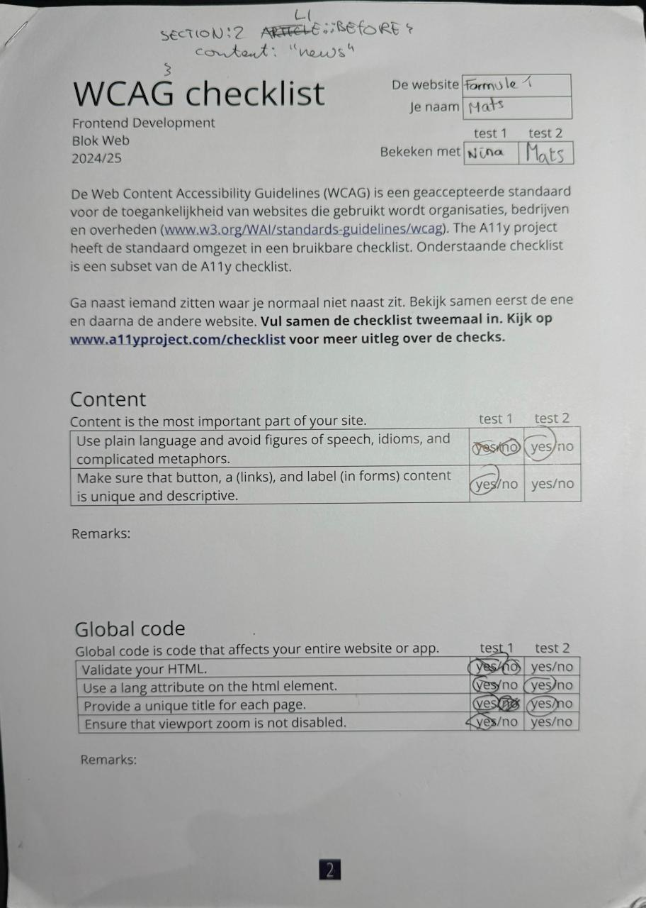
  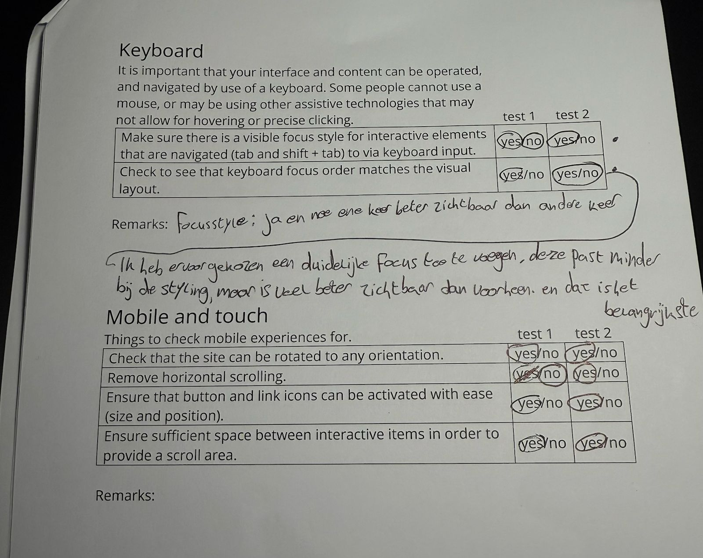
  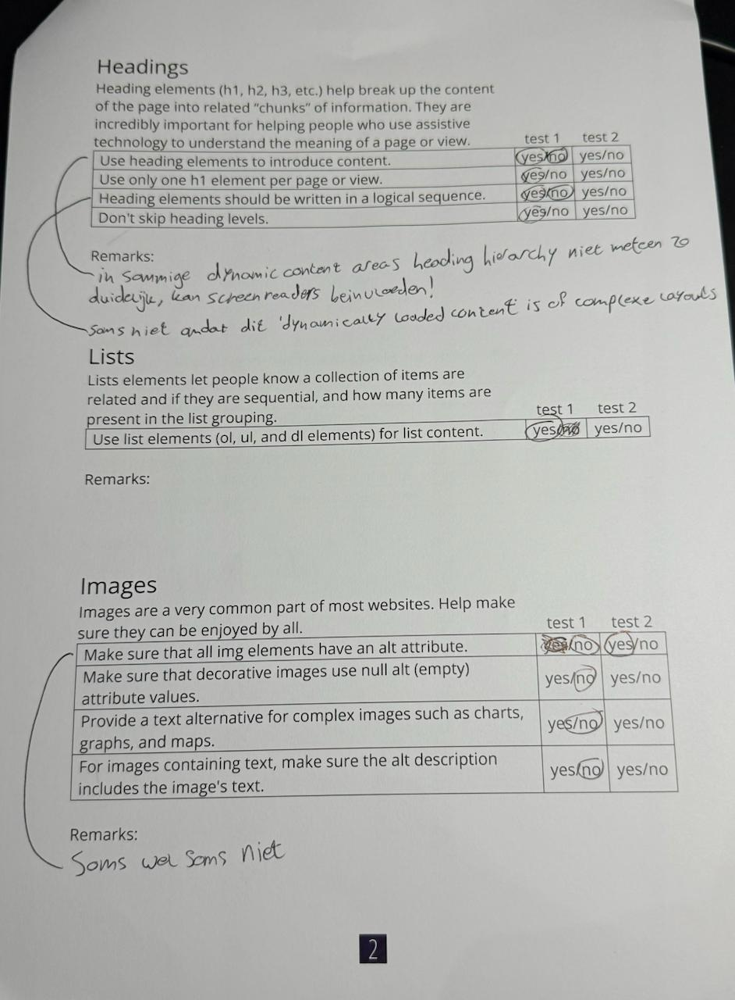
  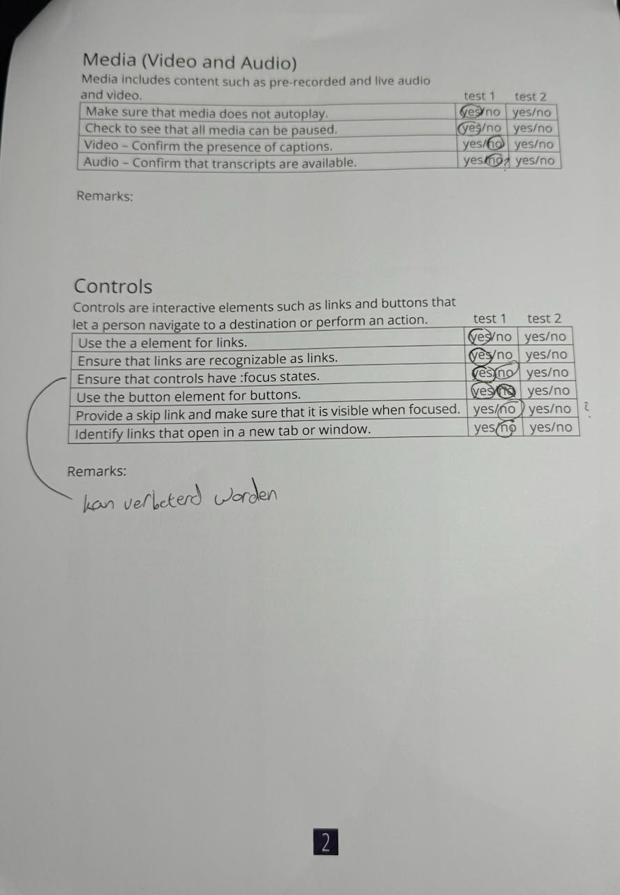
  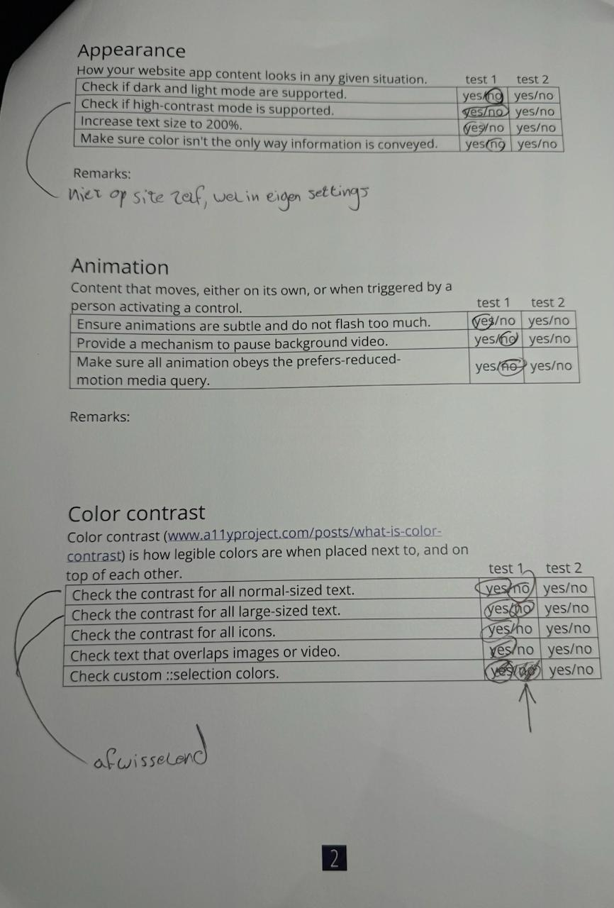

  Wat meteen opviel bij het taalgebruik is dat de taal de technische termen gebruikt uit de formule 1 wat voor mensen die voor het eerst op de site zitten toch best lastig zou kunnen zijn.

  Na het valideren van de HTML zijn er toch een hoop dingen die naar voren kwamen die niet helemaal goed waren.
  

  Het is afwisselend met de focusstyles, soms wel goed zichtbaar maar soms ook bijna niet.

  In sommige dynamische content area's is de heading hiërarchie niet meteen duidelijk, en dit kan screen readers beïnvloeden. 
  Hetzelfde geldt ook voor dynamisch geladen content en complexe layouts

  Niet alle foto's hebben een alt tekst of een eventuele lege alt. Ook zijn er geen alternatieve teksten voor grafieken o.i.d.
  Ook foto's met tekst bevatten deze tekst niet in de alt tekst.

  De video's bevatten zelf geen caption, maar sommige delen van de video worden onder de video uitgewerkt, bijvoorbeeld bij een interview. Ook transcript is niet beschikbaar.

  Er is geen ingeboude schakelaar voor darkmode en high contrast mode. Darkmode werkt ook niet met systeem instellingen
  maar high contrast mode wel.

  Niet alle animaties hebben de prefers-reduced-motion media query.

  Ook het contras kan op sommige plekken beter voor zowel tekst als iconen.

  !!!!! De bevindingen hierboven zijn soms ook op de surface plane gericht, ik heb uiteindelijk gekozen voor responsive.

## Breakdownschets (week 1)

  
uitwerken na afloop 3e werkgroep

  ### de hele pagina: 
  
  Dit is de breakdown van de eerste pagina die ik na ga maken en verbeteren.
  
  
  Dit is de breakdown van de tweede pagina die ik na ga maken en verbeteren.
  

  Dit is de screenshot van hoe mijn hamburgermenu ongeveer zou moeten worden. Dit zal er waarschijnlijk wel wat meer basic zijn.
  ### dynamisch deel (bijv menu): 
  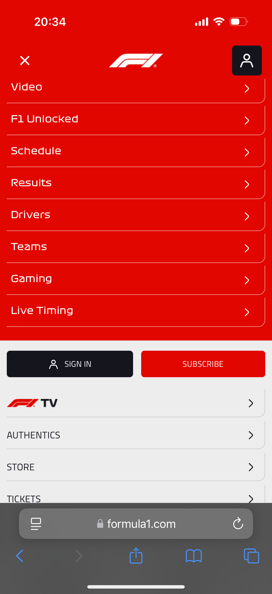

## Voortgang 1 (week 2)

  
uitwerken voor 1e voortgang

  ### Stand van zaken
  Voordat we het eerste voortgangs gesprek hadden, had ik al een HTML opzet gemaakt voor mijn website. Dit heb ik gedaan met de beperkte ervaring die ik uit eerdere vakken heb geleerd. Tijdens het gesprek waren er zoals ik al wel verwacht had wel een aantal dingen die eventueel aangepast zouden moeten worden, maar dat lees je hieronder.

  ### Verslag van meeting

  - Let op wanneer je een linkje gebruikt en wanneer je een button gebruikt.
  - Oefen (als je dit wilt) met een table i.p.v een list! (voor de driver standings)
  - Het grote paarse vlak zou je een aside kunnen maken.
  - Maak de site niet exact na, maar oefen met verschillende onderdelen die je ook zou willen leren.
  - De H1 kan ook een image zijn, maar vergeet dan niet een juiste alt tekst toe te voegen.
  Tijdens de eerste meeting zijn we met elkaar en de docent door elke site heen gegaan en hiervan geconstateerd wat de headings waren, en hoe de site in zijn algemeen is opgedeeld. Na een aantal tips & tricks is het wel gelukt om een goede opzet voor de website te maken.
  - Ik heb ervoor gekozen wat minder content op mijn pagina te stoppen, omdat het anders wel heel veel is, en daar heb ik helaas de tijd niet voor in deze korte periode.

## Voortgang 2 (week 3)

  
uitwerken voor 2e voortgang

  ### Stand van zaken
  hier dit ging goed & dit was lastig (neem ook screenshots op van delen van je website en code)

  Mijn eerste pagina is bijna af, het is nog echt de puntjes op de i zetten. Zo heb ik ook de docent en de studentassistenten gevraagd om een beetje hulp. De pagina is responsive en is dus zowel op telefoon als op grotere schermen goed te gebruiken. Ook heb ik nog samen met de docent gezeten en gekeken naar mijn html structuur, en ook die zag er nu goed uit. 

  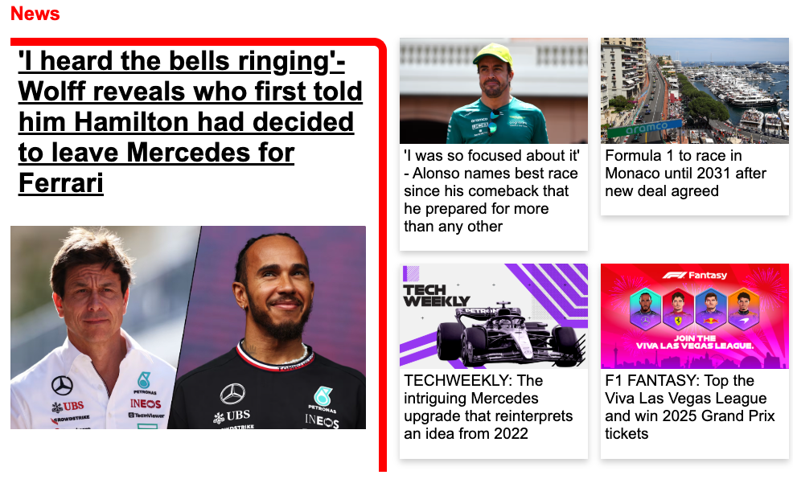

  
  ### Verslag van meeting
  hier na afloop snel de uitkomsten van de meeting vastleggen

  - Ik zat tijdens deze meeting met een studentassistent.

  - ik heb gevraagd of ze mij kon helpen met het responsive maken van mijn website. Zo heeft ze mij geholpen om een grid layout neer te zetten waardoor het al meteen een stuk mooier werd. Ik vond het wel ingewikkeld.

  - Daarna heeft ze gezegd dat ik zelf ook een media query moet gaan maken. Dit maakt het responsive design veel beter en ook wat overzichtelijker. 

## Toegankelijkheidstest 2/2 (week 4)

  
uitwerken na test in 9e werkgroep

  ### Bevindingen
  Lijst met je bevindingen die in de test naar voren kwamen (geef ook aan wat er verbeterd is):

  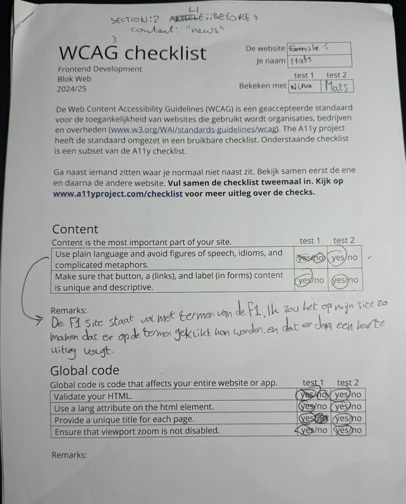
  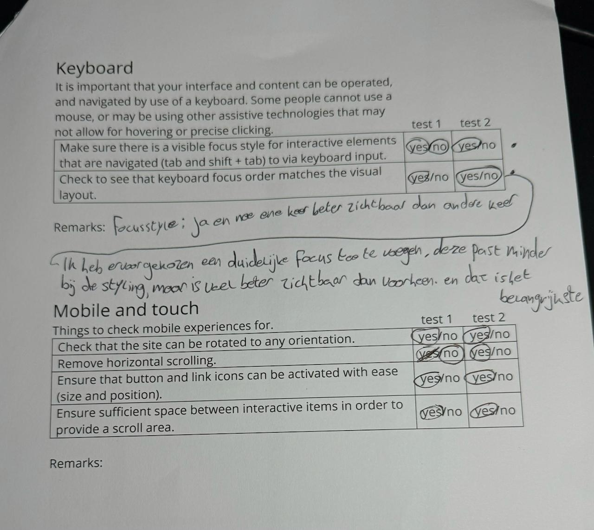
  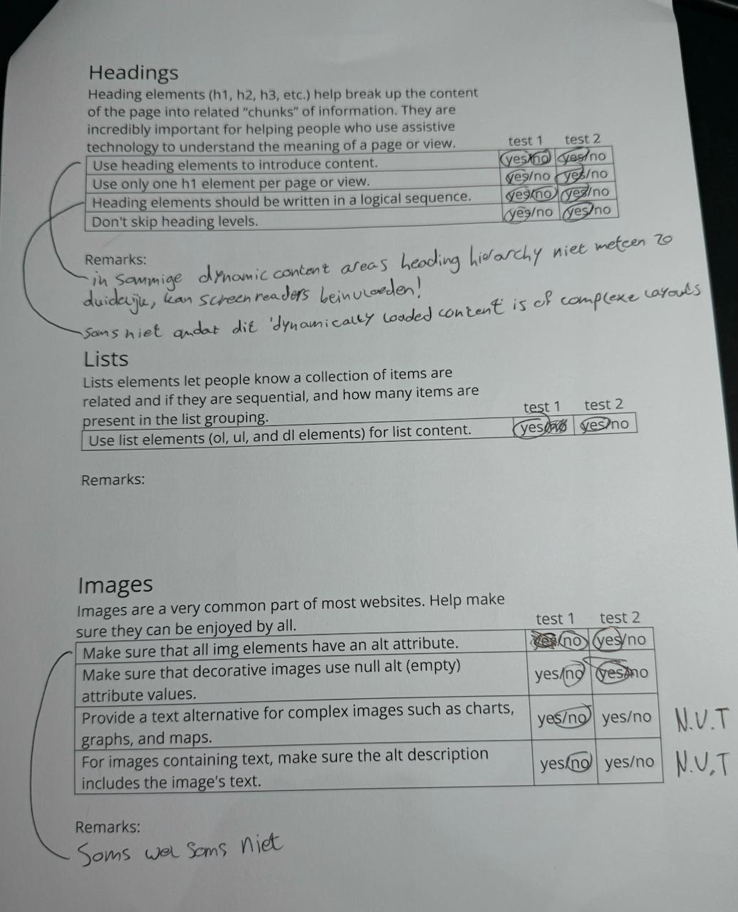
  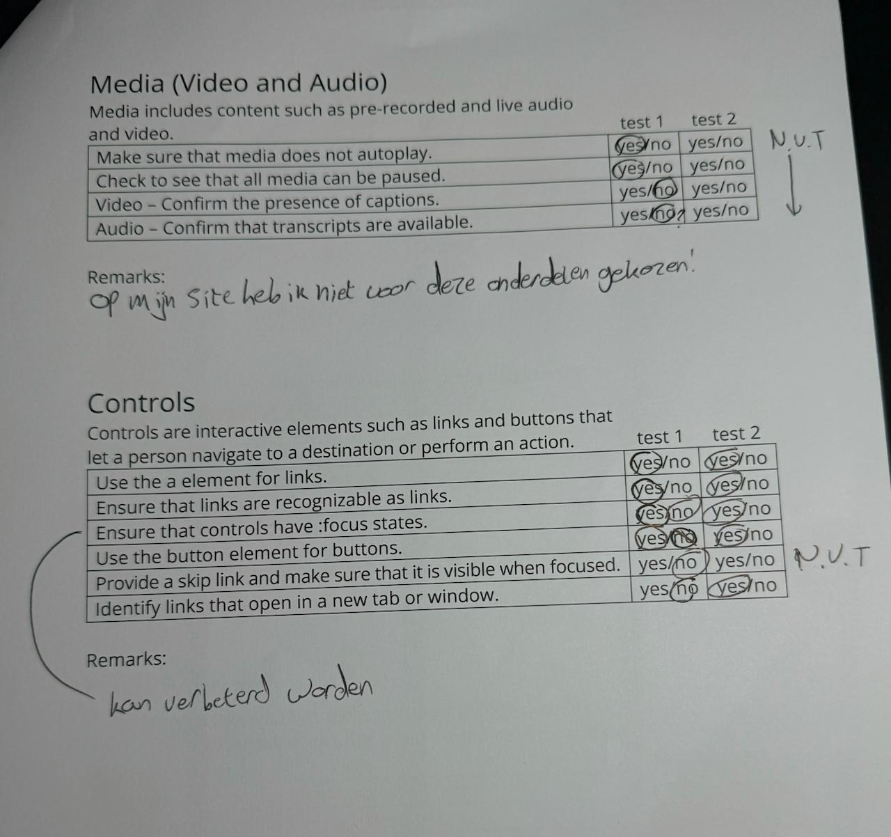
  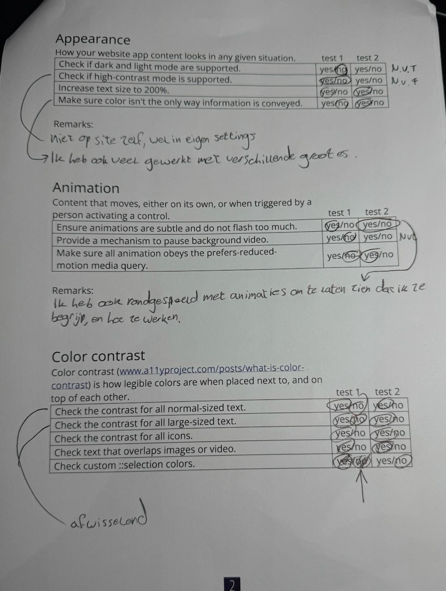

  - Het eerste wat opviel was dat de site makkelijke taal moest gebruiken. Nou is het zo dat de F1 website nou eenmaal termen uit de F1 wereld moet gebruiken. Als ik meer tijd had gehad, had ik op mijn site een idee gehad waarbij je op moelijke termen kon klikken voor een korte uitleg over wat dit betekent, speciaal voor mensen die nieuw zijn in de sport.

  - Het tweede wat opviel was dat mijn validatie een stuk beter was dan die van de F1 site. Ik had alleen warnings met dat mijn articles geen headings hebben, maar hier lees je meer over in de voortgang 3, in week 4. Verder had ik helemaal geen meldingen, dus ik ben tevreden.

  - Het tweede punt is dat ik de focusstyles heb aangepakt, omdat deze op de F1 site niet heel erg duidelijk waren. Ik heb deze een stuk duidelijker gemaakt, wat de accesability bevorderd. 

  - Wat ik ook heb gedaan t.o.v. de F1 site, is dat ik horizontal scrolling uit heb weten te zetten. Dit vind ik zelf ook een vervelend iets, dus ik ben blij dat ik het op mijn site heb kunnen verbeteren.

  - Ook heb ik bij veel foto's die decoratief zijn, de alt tekst opengelaten zodat screenreaders deze niet onnodig zullen oplezen.

  - Ook heb ik ervoor gezorgd dat kleuren niet de enige manier is hoe informatie wordt verdeeld en getoond, maar ook door verschillendew grootes te gebruiken doe ik dit.

  - Ik heb ervoor gezorgd dat de prefers reduced motion media query werkt, maar ik heb voor de animaties zelf ook rondgespeeld en heb op mijn site dus ook wat minder normale animaties.

## Voortgang 3 (week 4)

  
uitwerken voor 3e voortgang

  ### Stand van zaken
  De eerste pagina is af, ik moet hier alleen nog maar een navigatie toe te voegen. Ik wil in het volgende voortgangsgesprek een aantal vragen stellen over het menu dat ik wil maken. Daarna ga ik hard aan de slag met het maken van mijn tweede pagina. Het is wel zo dat als ik mijn HTML validatie in vscode doe, dat ik een aantal info's te zien krijg. Dit heeft vooral te maken met dat de articles geen heading hebben. Nou is dit niet erg omdat ik van de docent heb gehoord dat dit juist fijn is voor de leesbaarheid in mijn geval.

  ### Verslag van meeting
  hier na afloop snel de uitkomsten van de meeting vastleggen

  - Dankzij de hulp van de docent heb ik nu een voorbeeld gekregen van hoe een responsive navbar eruit ziet, en hoe ik deze zelf kan gaan maken. Deze ga ik de komende dagen integreren in mijn werk.

  - Na de meeting ben ik naar huis gegaan en heb ik nog even nagedacht over accesability toen mij ineens iets tebinnen schoot wat ik ook nog kon doen met mijn site, waar de F1 site niet aan heeft gedacht. Ik heb later nog een media query aangemaakt voor prefers reduced motion. Dit was heel makkelijk toe te passen maar is toch belangrijk voor veel mensen. 

  - Helaas had ik voor deze meeting nog geen tweede pagina die ik kon laten zien dus hier heb ik alleen feedback op gehad van vrienden, en daar kon ik wel wat mee, maar het is natuurlijk niet zoals de feedback van de docent en van de studentassistenten.

## Eindgesprek (week 5)

  
uitwerken voor eindgesprek

  ### Je uitkomst - karakteristiek screenshots:

  Pagina 1, laptop
  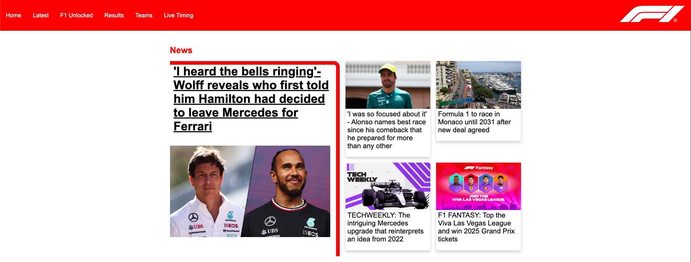
  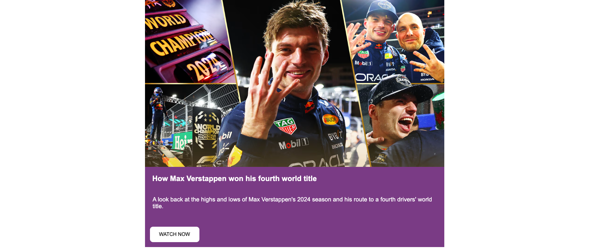
  
  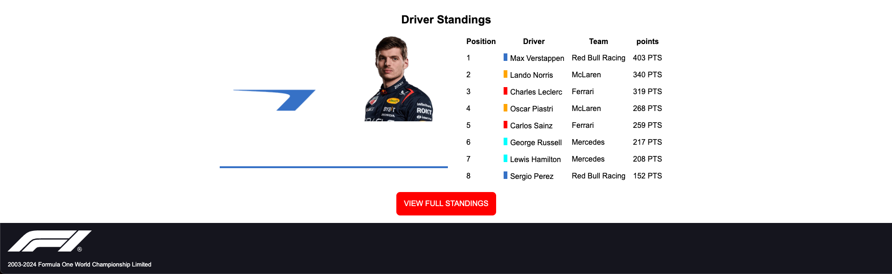

  pagina 1, telefoon
  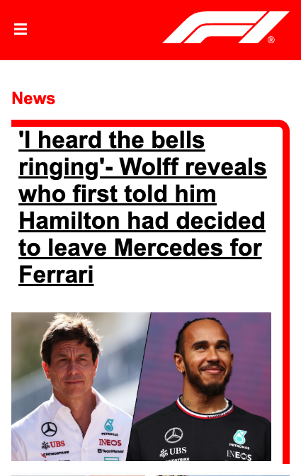
  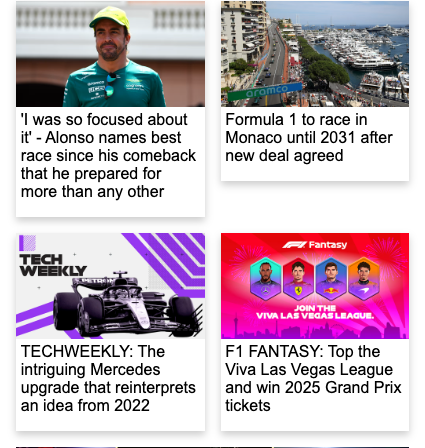
  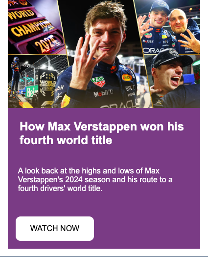
  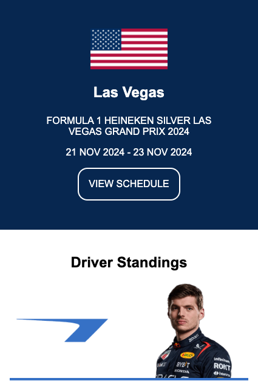
  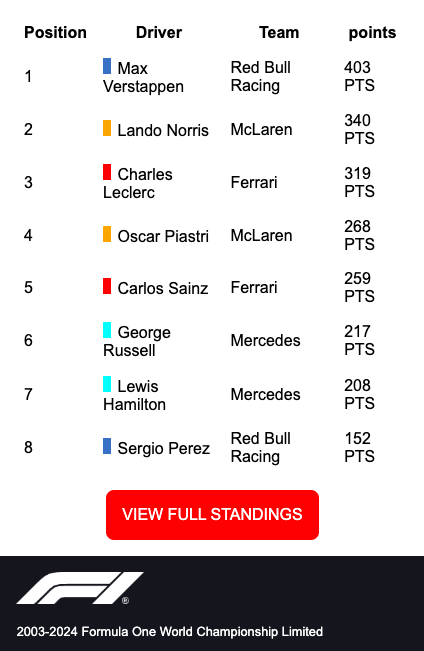

  pagina 2, laptop
  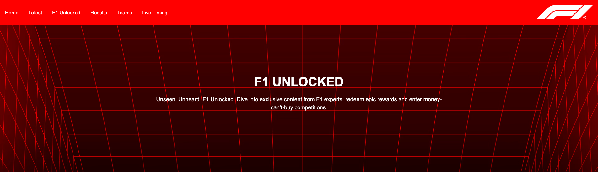
  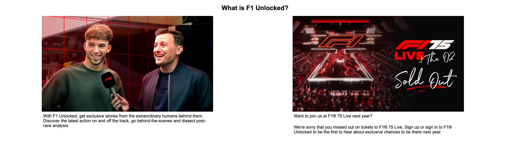
  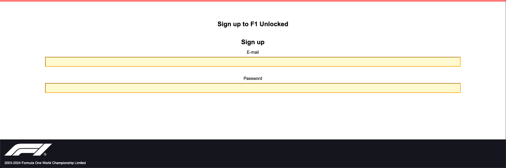

  pagina 2, telefoon
  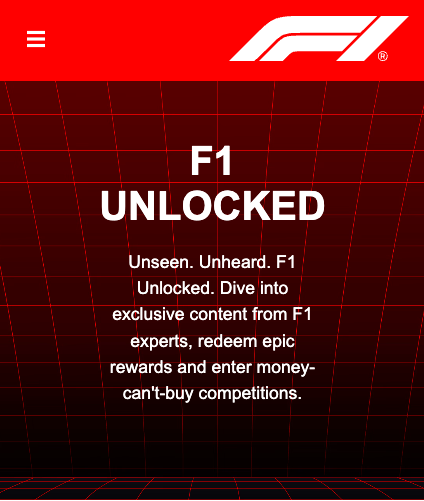
  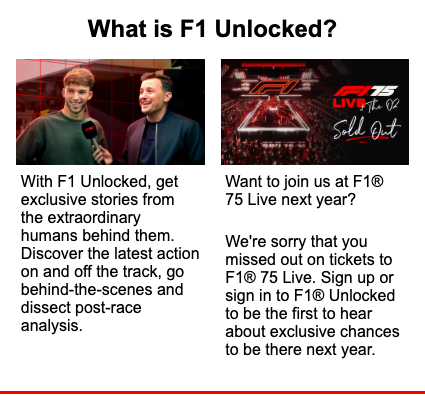
  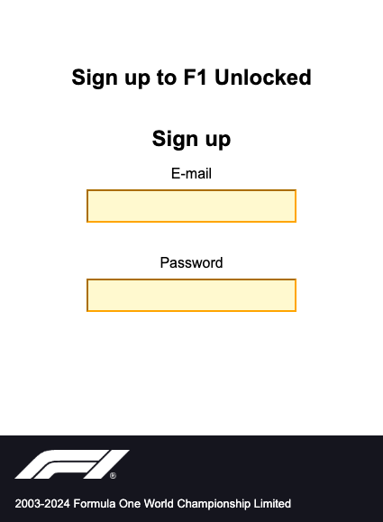

  menu, telefoon
  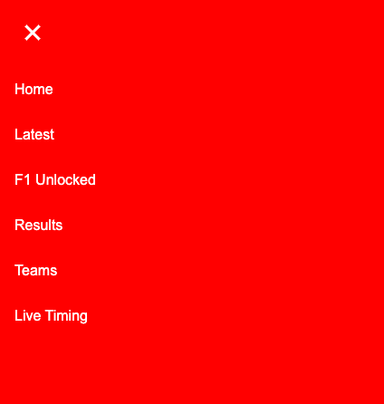

  ### Dit ging goed/Heb ik geleerd: 

  Ik ben erg tevreden over wat ik heb geleerd als het aankomt op het gebied van responsive design. Het is nog niet perfect maar dit is ook pas de eerste keer dat ik hier echt wat mee heb gedaan. 
  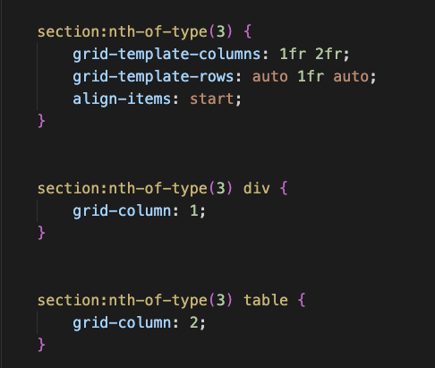

  Ook heb ik natuurlijk geleerd hoe je beter kunt designen met accessabilty in het achterhoofd, en waar je allemaal rekening mee moet houden. Ook weet ik dat de WCAG checklist niet alles is, en dat er daarbuiten nog een hoop is wat je website kan optimaliseren. 

  Ik heb tijdens FED ook geleerd hoe je animaties kan maken in css, hoe je media query's gebruikt en ben ik verder gegroeid in mijn algemene begrip voor html, css en javascript.

  ### Dit was lastig/Is niet gelukt:
  Korte omschrijving met plaatjes
  Wat ik nog wel lastig vind is Javascript. Ik heb hiervoor veel gebruik gemaakt van de voorbeeld opdrachten die beschikbaar waren voor ons, en hulp gevraagd. Ik vind het lastig om hier de structuur in te zien, ondanks dat ik deze wel kan begrijpen als het er eenmaal staat. Nou weet ik ook dat we bij dit vak hier niet veel tijd aan hebben besteed en dat het later allemaal wel goed zal komen.
  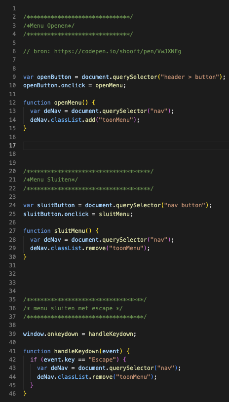

  Ook zijn er enkele elementen in mijn html en css die niet perfect zijn, maar met meer tijd en met wat meer oefening zou ik deze beter onder de knie kunnen krijgen en perfectioneren. 

  Ik zou ook graag wat beter willen worden met de inspect element tool op mijn browser om zo makkelijker problemen op te sporen en zo te kunnen fixen. Dit zou mij een hoop tijd besparen.

## Bronnenlijst

  
continu bijhouden terwijl je werkt

  Nb. Wees specifiek ('css-tricks' als bron is bijv. niet specifiek genoeg). 
  Nb. ChatGpT en andere AI horen er ook bij.
  Nb. Vermeld de bronnen ook in je code.

  1. https://stackoverflow.com/questions/17756649/disable-the-horizontal-scroll
  
  2. https://www.formula1.com/ (alle tekst en plaatjes)

  3. https://chatgpt.com/ (alles wat met de hulp van chatgpt is gedaan staat bij het stukje code waarbij is geholpen)

  4. https://www.w3schools.com/html/html_tables.asp
  
  5. https://codepen.io/shooft/pen/VwJXNEg
  
  6. Docent/studentassistenten

  7. https://www.cssmatic.com/box-shadow

  8. https://codepen.io/joostf/pen/VKyPxZ?editors=0100

  9. https://codepen.io/shooft/pen/RwzxdJq

  10. https://developer.mozilla.org/en-US/docs/Web/CSS/@media/prefers-reduced-motion

