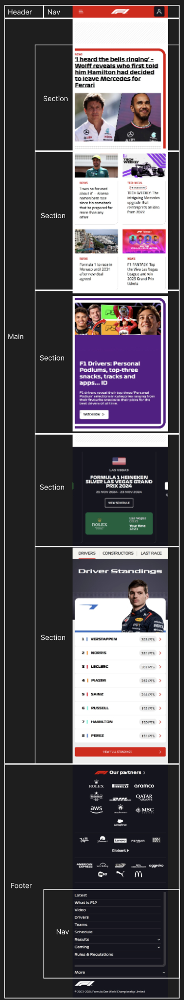
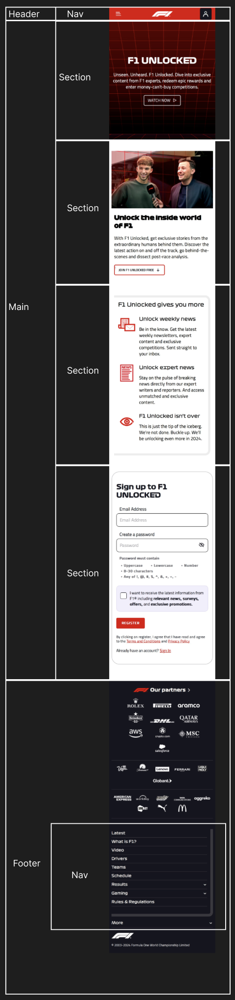

# Procesverslag
Markdown is een simpele manier om HTML te schrijven.  
Markdown cheat cheet: [Hulp bij het schrijven van Markdown](https://github.com/adam-p/markdown-here/wiki/Markdown-Cheatsheet).

Nb. De standaardstructuur en de spartaanse opmaak van de README.md zijn helemaal prima. Het gaat om de inhoud van je procesverslag. Besteedt de tijd voor pracht en praal aan je website.

Nb. Door *open* toe te voegen aan een *details* element kun je deze standaard open zetten. Fijn om dat steeds voor de relevante stuk(ken) te doen.

## Jij

  
uitwerken voor kick-off werkgroep

  ### Auteur:
  Mats van der Zwan

  #### Je startniveau:
  tussen blauw en rood in

  #### Je focus:
  Responsive, en een klein beetje surface plane voor de lol.
 

## Je website

  
uitwerken voor kick-off werkgroep

  ### Je opdracht:
  https://www.formula1.com

  #### Screenshot(s) van de eerste pagina (small screen): 
  homepage  
  

  #### Screenshot(s) van de tweede pagina (small screen):
  schedule  
  
 

## Toegankelijkheidstest 1/2 (week 1)

  
uitwerken na test in 2e werkgroep

  ### Bevindingen
  Lijst met je bevindingen die in de test naar voren kwamen:

  Wat meteen opviel bij het taalgebruik is dat de taal de technische termen gebruikt uit de formule 1 wat voor mensen die voor
  het eerst op de site zitten toch best lastig zou kunnen zijn.

  Na het valideren van de HTML zijn er toch een hoop dingen die naar voren kwamen die niet helemaal goed waren.
  

  Het is afwisselend met de focusstyles, soms wel goed zichtbaar maar soms ook bijna niet.

  In sommige dynamische content area's is de heading hiërarchie niet meteen duidelijk, en dit kan screen readers beïnvloeden. 
  Hetzelfde geldt ook voor dynamisch geladen content en complexe layouts

  Niet alle foto's hebben een alt tekst of een eventuele lege alt. Ook zijn er geen alternatieve teksten voor grafieken o.i.d.
  Ook foto's met tekst bevatten deze tekst niet in de alt tekst.

  De video's bevatten zelf geen caption, maar sommige delen van de video worden onder de video uitgewerkt, bijvoorbeeld bij een interview.
  Ook transcript is niet beschikbaar.

  Er is geen ingeboude schakelaar voor darkmode en high contrast mode. Darkmode werkt ook niet met systeem instellingen
  maar high contrast mode wel.

  Niet alle animaties hebben de prefers-reduced-motion media query.

  Ook het contras kan op sommige plekken beter voor zowel tekst als iconen.

## Breakdownschets (week 1)

  
uitwerken na afloop 3e werkgroep

  ### de hele pagina: 
  
  Dit is de breakdown van de eerste pagina die ik na ga maken en verbeteren.
  
  
  Dit is de breakdown van de tweede pagina die ik na ga maken en verbeteren.
  

  Dit is de screenshot van hoe mijn hamburgermenu ongeveer zou moeten worden.
  ### dynamisch deel (bijv menu): 
  

## Voortgang 1 (week 2)

  
uitwerken voor 1e voortgang

  ### Stand van zaken
  Voordat we het eerste voortgangs gesprek hadden, had ik al een HTML opzet gemaakt voor mijn website. Dit heb ik gedaan met de beperkte ervaring die ik uit eerdere vakken heb geleerd. Tijdens het gesprek waren er zoals ik al wel verwacht had wel een aantal dingen die eventueel aangepast zouden moeten worden, maar dat lees je hieronder.

  ### Verslag van meeting
  hier na afloop snel de uitkomsten van de meeting vastleggen

  - Let op wanneer je een linkje gebruikt en wanneer je een button gebruikt.
  - Oefen (als je dit wilt) met een table i.p.v een list! (voor de driver standings)
  - Het grote paarse vlak zou je een aside kunnen maken.
  - Maak de site niet exact na, maar oefen met verschillende onderdelen die je ook zou willen leren.
  - De H1 kan ook een image zijn, maar vergeet dan niet een juiste alt tekst toe te voegen.
  Tijdens de eerste meeting zijn we met elkaar en de docent door elke site heen gegaan en hiervan geconstateerd wat de headings waren, en hoe de site in zijn algemeen is opgedeeld. Na een aantal tips & tricks is het wel gelukt om een goede opzet voor de website te maken.

## Voortgang 2 (week 3)

  
uitwerken voor 2e voortgang

  ### Stand van zaken
  hier dit ging goed & dit was lastig (neem ook screenshots op van delen van je website en code)

  Mijn eerste pagina is bijna af, het is nog echt de puntjes op de i zetten. Zo heb ik ook de docent en de studentassistenten gevraagd om een beetje hulp. De pagina is responsive en is dus zowel op telefoon als op grotere schermen goed te gebruiken. Ook heb ik nog samen met de docent gezeten en gekeken naar mijn html structuur, en ook die zag er nu goed uit. 

  
  ### Verslag van meeting
  hier na afloop snel de uitkomsten van de meeting vastleggen

  - Ik zat tijdens deze meeting met een studentassistent.

  - ik heb gevraagd of ze mij kon helpen met het responsive maken van mijn website. Zo heeft ze mij geholpen om een grid layout neer te zetten waardoor het al meteen een stuk mooier werd. Ik vond het wel ingewikkeld.

  - Daarna heeft ze gezegd dat ik zelf ook een media query moet gaan maken. Dit maakt het responsive design veel beter en ook wat overzichtelijker. 

## Toegankelijkheidstest 2/2 (week 4)

  
uitwerken na test in 9e werkgroep

  ### Bevindingen
  Lijst met je bevindingen die in de test naar voren kwamen (geef ook aan wat er verbeterd is):

## Voortgang 3 (week 4)

  
uitwerken voor 3e voortgang

  ### Stand van zaken
  De eerste pagina is af, ik moet hier alleen nog maar een navigatie toe te voegen. Ik wil in het volgende voortgangsgesprek een aantal vragen stellen over het menu dat ik wil maken. Daarna ga ik hard aan de slag met het maken van mijn tweede pagina. Het is wel zo dat als ik mijn HTML validate in vscode doe, dat ik een aantal info's te zien krijg. Dit heeft vooral te maken met dat de articles geen heading hebben. Nou is dit niet erg omdat ik van de docent heb gehoord dat dit juist fijn is voor de leesbaarheid in mijn geval.

  ### Verslag van meeting
  hier na afloop snel de uitkomsten van de meeting vastleggen

  - Dankzij de hulp van de docent heb ik nu een voorbeeld gekregen van hoe een responsive navbar eruit ziet, en hoe ik deze zelf kan gaan maken. Deze ga ik de komende dagen integreren in mijn werk.

## Eindgesprek (week 5)

  
uitwerken voor eindgesprek

  ### Je uitkomst - karakteristiek screenshots:
  

  ### Dit ging goed/Heb ik geleerd: 
  Korte omschrijving met plaatjes

  

  ### Dit was lastig/Is niet gelukt:
  Korte omschrijving met plaatjes

  

## Bronnenlijst

  
continu bijhouden terwijl je werkt

  Nb. Wees specifiek ('css-tricks' als bron is bijv. niet specifiek genoeg). 
  Nb. ChatGpT en andere AI horen er ook bij.
  Nb. Vermeld de bronnen ook in je code.

  1. https://stackoverflow.com/questions/17756649/disable-the-horizontal-scroll
  
  2. https://www.formula1.com/

  3. https://chatgpt.com/ (alles wat met de hulp van chatgpt is gedaan staat bij het stukje code waarbij is geholpen)

  4. https://www.w3schools.com/html/html_tables.asp
  
  5. https://codepen.io/shooft/pen/VwJXNEg
  
  6. Docent/studentassistenten

  7. https://www.cssmatic.com/box-shadow

  8. https://codepen.io/joostf/pen/VKyPxZ?editors=0100

